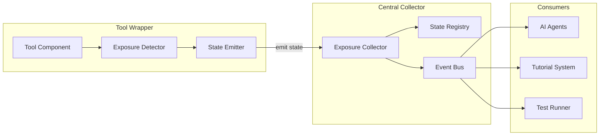
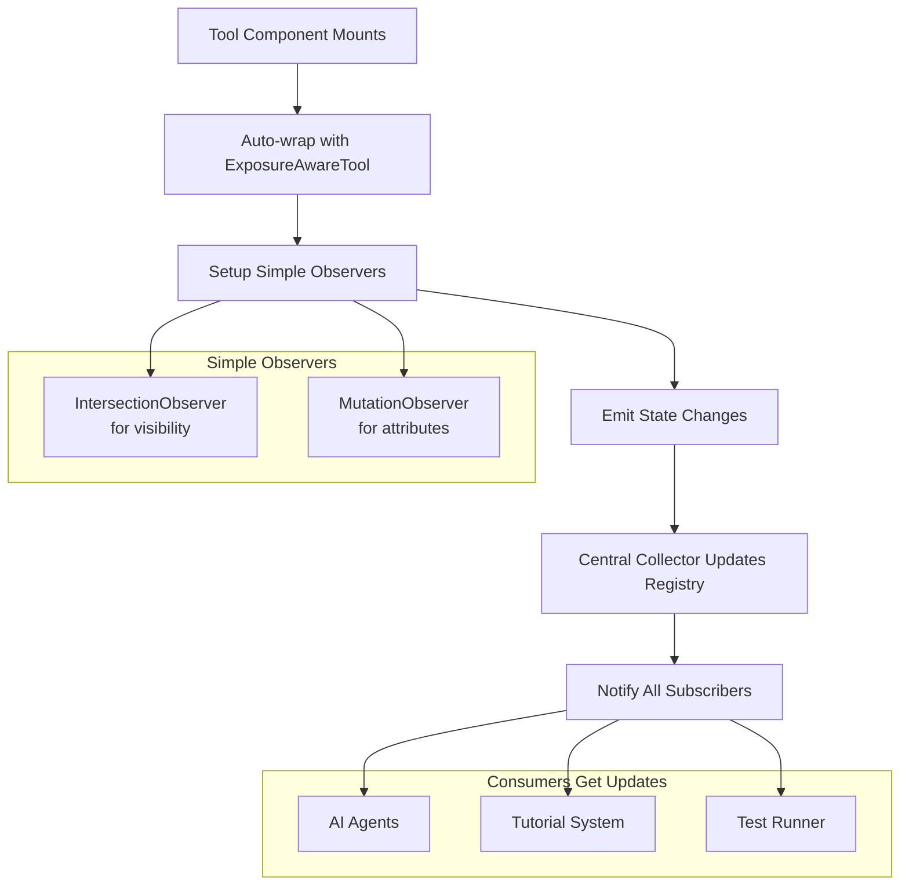

# Supernal Interface Enhanced Tool System - Implementation Plan

## Executive Summary

This document outlines a comprehensive plan to enhance the existing `@supernal-interface/core` tool system with advanced exposure detection, Gherkin-driven workflow chains, and intelligent tutorial orchestration. The system will transform from basic tool discovery into a sophisticated platform that understands tool states, generates multi-path test suites, and enables complex workflow automation.

## Current System Analysis

### Existing Architecture Strengths
- **Unified Tool Registry**: Central `ToolRegistry` with provider and tool management
- **Multi-Context Execution**: Support for both UI (Playwright) and API execution contexts
- **Decorator-Based Registration**: `@Tool` decorator with comprehensive metadata
- **AI Safety Classification**: Tool types from `test-only` to `ai-dangerous`
- **Automatic Test Generation**: Playwright test generation from tool metadata

### Current Limitations
- **Basic Exposure Detection**: Only checks `waitFor({ state: 'visible' })`
- **No State Hierarchy**: Cannot distinguish between present, visible, exposed, interactable
- **Limited Chain Support**: No workflow or multi-step tool execution
- **No Gherkin Integration**: No BDD scenario to tool mapping
- **Static Tutorial System**: No dynamic workflow orchestration

## Enhanced System Architecture

### 1. Event-Driven Tool Exposure Management

#### Simple State Emission Architecture



#### Tool State Emission System

```typescript
enum ExposureState {
  NOT_PRESENT = 0,    // Element doesn't exist in DOM
  PRESENT = 1,        // Element exists but may not be visible
  VISIBLE = 2,        // Element has dimensions and is not hidden
  EXPOSED = 3,        // Element is visible to user (no overlays)
  INTERACTABLE = 4,   // Element can be clicked/used right now
  ACCESSIBLE = 5      // Element meets accessibility requirements
}

interface ToolStateEvent {
  toolId: string;
  state: ExposureState;
  timestamp: number;
  metadata?: {
    reason?: string;
    blockers?: string[];
    position?: DOMRect;
    confidence?: number;
  };
}

// Simple wrapper that emits state changes
class ExposureAwareTool {
  private toolId: string;
  private element: HTMLElement;
  private currentState: ExposureState = ExposureState.NOT_PRESENT;
  private observer: IntersectionObserver;
  
  constructor(toolId: string, element: HTMLElement) {
    this.toolId = toolId;
    this.element = element;
    this.setupObservers();
    this.checkInitialState();
  }
  
  private setupObservers() {
    // Simple intersection observer for visibility
    this.observer = new IntersectionObserver((entries) => {
      const entry = entries[0];
      const newState = this.calculateState(entry);
      
      if (newState !== this.currentState) {
        this.currentState = newState;
        this.emit(newState);
      }
    }, {
      threshold: [0, 0.1, 0.5, 1.0] // Multiple thresholds for granular detection
    });
    
    this.observer.observe(this.element);
    
    // Listen for attribute changes that affect interactability
    new MutationObserver((mutations) => {
      const relevantChange = mutations.some(m => 
        m.type === 'attributes' && 
        ['disabled', 'aria-disabled', 'class', 'style'].includes(m.attributeName)
      );
      
      if (relevantChange) {
        const newState = this.calculateCurrentState();
        if (newState !== this.currentState) {
          this.currentState = newState;
          this.emit(newState);
        }
      }
    }).observe(this.element, {
      attributes: true,
      attributeFilter: ['disabled', 'aria-disabled', 'class', 'style']
    });
  }
  
  private calculateState(entry: IntersectionObserverEntry): ExposureState {
    // Element not in DOM
    if (!this.element.isConnected) {
      return ExposureState.NOT_PRESENT;
    }
    
    // Element exists but not visible
    if (entry.intersectionRatio === 0) {
      return ExposureState.PRESENT;
    }
    
    // Element partially/fully visible
    if (entry.intersectionRatio > 0) {
      // Check if disabled
      if (this.element.hasAttribute('disabled') || 
          this.element.getAttribute('aria-disabled') === 'true') {
        return ExposureState.VISIBLE; // Visible but not interactable
      }
      
      // Check if loading
      if (this.element.getAttribute('aria-busy') === 'true' ||
          this.element.classList.contains('loading')) {
        return ExposureState.EXPOSED; // Exposed but not ready
      }
      
      // Fully interactable
      return ExposureState.INTERACTABLE;
    }
    
    return ExposureState.PRESENT;
  }
  
  private emit(state: ExposureState) {
    const event: ToolStateEvent = {
      toolId: this.toolId,
      state,
      timestamp: Date.now(),
      metadata: {
        reason: this.getStateReason(state),
        position: this.element.getBoundingClientRect(),
        confidence: 0.95 // High confidence since tool reports its own state
      }
    };
    
    // Emit to global collector
    ExposureCollector.getInstance().handleStateChange(event);
  }
  
  private getStateReason(state: ExposureState): string {
    switch (state) {
      case ExposureState.NOT_PRESENT: return 'Element not in DOM';
      case ExposureState.PRESENT: return 'Element exists but not visible';
      case ExposureState.VISIBLE: return 'Element visible but disabled';
      case ExposureState.EXPOSED: return 'Element exposed but loading';
      case ExposureState.INTERACTABLE: return 'Element ready for interaction';
      default: return 'Unknown state';
    }
  }
}
```

#### Central Exposure Collector

```typescript
class ExposureCollector {
  private static instance: ExposureCollector;
  private stateRegistry = new Map<string, ToolStateEvent>();
  private eventBus = new EventTarget();
  private subscribers = new Map<string, Set<StateChangeCallback>>();
  
  static getInstance(): ExposureCollector {
    if (!this.instance) {
      this.instance = new ExposureCollector();
    }
    return this.instance;
  }
  
  // Tools emit their state changes here
  handleStateChange(event: ToolStateEvent) {
    const previousState = this.stateRegistry.get(event.toolId);
    this.stateRegistry.set(event.toolId, event);
    
    // Notify subscribers
    this.notifySubscribers(event, previousState);
    
    // Emit global event
    this.eventBus.dispatchEvent(new CustomEvent('tool-state-change', {
      detail: { event, previousState }
    }));
  }
  
  // Get current state of any tool
  getToolState(toolId: string): ToolStateEvent | null {
    return this.stateRegistry.get(toolId) || null;
  }
  
  // Get all tools in a specific state
  getToolsByState(state: ExposureState): ToolStateEvent[] {
    return Array.from(this.stateRegistry.values())
      .filter(event => event.state === state);
  }
  
  // Get all interactable tools
  getInteractableTools(): ToolStateEvent[] {
    return this.getToolsByState(ExposureState.INTERACTABLE);
  }
  
  // Subscribe to state changes for specific tools or all tools
  subscribe(callback: StateChangeCallback, toolId?: string) {
    const key = toolId || '*';
    if (!this.subscribers.has(key)) {
      this.subscribers.set(key, new Set());
    }
    this.subscribers.get(key)!.add(callback);
  }
  
  // Wait for a tool to reach a specific state
  async waitForState(toolId: string, targetState: ExposureState, timeout = 5000): Promise<boolean> {
    const currentState = this.getToolState(toolId);
    if (currentState && currentState.state >= targetState) {
      return true;
    }
    
    return new Promise((resolve) => {
      const timeoutId = setTimeout(() => resolve(false), timeout);
      
      const callback = (event: ToolStateEvent) => {
        if (event.toolId === toolId && event.state >= targetState) {
          clearTimeout(timeoutId);
          resolve(true);
        }
      };
      
      this.subscribe(callback, toolId);
    });
  }
  
  private notifySubscribers(event: ToolStateEvent, previousState?: ToolStateEvent) {
    // Notify tool-specific subscribers
    const toolSubscribers = this.subscribers.get(event.toolId);
    if (toolSubscribers) {
      toolSubscribers.forEach(callback => callback(event, previousState));
    }
    
    // Notify global subscribers
    const globalSubscribers = this.subscribers.get('*');
    if (globalSubscribers) {
      globalSubscribers.forEach(callback => callback(event, previousState));
    }
  }
}

type StateChangeCallback = (event: ToolStateEvent, previousState?: ToolStateEvent) => void;
```

#### Enhanced @Tool Decorator with Auto-Wrapping

```typescript
// Enhanced decorator that automatically wraps tools with exposure detection
export function Tool(config: ToolConfig) {
  return function(target: any, propertyKey: string, descriptor: PropertyDescriptor) {
    // Original tool registration logic...
    const originalMethod = descriptor.value;
    
    // Enhanced method that includes exposure awareness
    descriptor.value = async function(...args: any[]) {
      const toolId = config.testId || `${target.constructor.name}.${propertyKey}`;
      
      // Check if tool is interactable before execution
      const collector = ExposureCollector.getInstance();
      const currentState = collector.getToolState(toolId);
      
      if (!currentState || currentState.state < ExposureState.INTERACTABLE) {
        // Wait for tool to become interactable
        const isReady = await collector.waitForState(toolId, ExposureState.INTERACTABLE, 5000);
        
        if (!isReady) {
          throw new Error(`Tool ${toolId} is not interactable. Current state: ${currentState?.state || 'unknown'}`);
        }
      }
      
      // Execute original method
      return originalMethod.apply(this, args);
    };
    
    // Auto-wrap the associated DOM element when component mounts
    if (typeof window !== 'undefined') {
      setTimeout(() => {
        const element = document.querySelector(`[data-testid="${config.testId}"]`) as HTMLElement;
        if (element) {
          new ExposureAwareTool(toolId, element);
        }
      }, 0);
    }
    
    return descriptor;
  };
}
```

#### Simple Usage Examples

##### AI Agent Usage
```typescript
// AI agent can easily check what tools are available
class AIAgent {
  async findAvailableTools(): Promise<string[]> {
    const collector = ExposureCollector.getInstance();
    const interactableTools = collector.getInteractableTools();
    
    return interactableTools.map(tool => tool.toolId);
  }
  
  async executeCommand(command: string) {
    // Parse command to find target tool
    const toolId = this.parseCommand(command);
    
    // Wait for tool to be ready
    const collector = ExposureCollector.getInstance();
    const isReady = await collector.waitForState(toolId, ExposureState.INTERACTABLE, 3000);
    
    if (isReady) {
      // Execute the tool
      await ToolRegistry.executeTool(toolId, {});
    } else {
      throw new Error(`Tool ${toolId} is not available`);
    }
  }
}
```

##### Tutorial System Usage
```typescript
// Tutorial system can guide users to available tools
class TutorialSystem {
  async startTutorial(steps: string[]) {
    const collector = ExposureCollector.getInstance();
    
    for (const toolId of steps) {
      // Wait for current step to be available
      console.log(`Waiting for ${toolId} to be ready...`);
      await collector.waitForState(toolId, ExposureState.INTERACTABLE);
      
      // Highlight the tool
      this.highlightTool(toolId);
      
      // Wait for user to complete the step
      await this.waitForUserAction(toolId);
    }
  }
  
  private highlightTool(toolId: string) {
    const collector = ExposureCollector.getInstance();
    const toolState = collector.getToolState(toolId);
    
    if (toolState?.metadata?.position) {
      // Show spotlight at tool position
      this.showSpotlight(toolState.metadata.position);
    }
  }
}
```

##### Test Runner Usage
```typescript
// Test runner can verify tool states before testing
class TestRunner {
  async runTest(testScenario: TestScenario) {
    const collector = ExposureCollector.getInstance();
    
    for (const step of testScenario.steps) {
      // Verify tool is available before testing
      const toolState = collector.getToolState(step.toolId);
      
      if (!toolState || toolState.state < ExposureState.INTERACTABLE) {
        throw new Error(`Test failed: ${step.toolId} is not interactable`);
      }
      
      // Execute test step
      await this.executeTestStep(step);
    }
  }
  
  async generateTestReport(): Promise<TestReport> {
    const collector = ExposureCollector.getInstance();
    const allTools = Array.from(collector.stateRegistry.values());
    
    return {
      totalTools: allTools.length,
      interactableTools: allTools.filter(t => t.state === ExposureState.INTERACTABLE).length,
      brokenTools: allTools.filter(t => t.state < ExposureState.VISIBLE).length,
      timestamp: Date.now()
    };
  }
}
```

#### Benefits of Event-Driven Approach

**Why This is Much Simpler:**

1. **No Complex Detection Logic**: Tools self-report their state instead of complex DOM analysis
2. **Real-Time Updates**: State changes are immediately available to all consumers
3. **High Performance**: No polling or expensive DOM queries
4. **Easy Integration**: Just wrap existing tools with `ExposureAwareTool`
5. **Reliable**: Tools know their own state better than external detection

**Implementation Simplicity:**



**Key Advantages:**

- **Minimal Code**: ~200 lines vs thousands for complex detection
- **Self-Reporting**: Tools know their state better than external analysis
- **Event-Driven**: Real-time updates without polling
- **Framework Agnostic**: Works with React, Vue, Angular, vanilla JS
- **Easy Testing**: Mock state events for comprehensive test coverage

**Integration with Existing System:**

```typescript
// Existing @Tool decorator automatically gets exposure awareness
@Tool({
  testId: 'submit-button',
  aiEnabled: true
})
async submitForm() {
  // Tool automatically waits for INTERACTABLE state before executing
  // No changes needed to existing tool methods
}

// Consumers can easily check tool availability
const availableTools = ExposureCollector.getInstance().getInteractableTools();
const isReady = await ExposureCollector.getInstance().waitForState('submit-button', ExposureState.INTERACTABLE);
```

### 2. Gherkin-to-Tool Chain Mapping

#### Natural Language Processing Pipeline
```typescript
interface GherkinScenario {
  feature: string;
  scenario: string;
  steps: GherkinStep[];
  tags: string[];
  metadata: Record<string, any>;
}

interface GherkinStep {
  keyword: 'Given' | 'When' | 'Then' | 'And' | 'But';
  text: string;
  parameters?: Record<string, any>;
  dataTable?: string[][];
}

interface ToolChain {
  id: string;
  name: string;
  description: string;
  steps: ToolChainStep[];
  preconditions: Condition[];
  postconditions: Condition[];
  alternativePaths: ToolChain[];
  errorHandling: ErrorHandler[];
}

interface ToolChainStep {
  toolId: string;
  parameters: Record<string, any>;
  exposureRequirements: ExposureState;
  timeout: number;
  retryPolicy: RetryPolicy;
  validation: ValidationRule[];
}
```

#### Scenario Mapping Engine
```typescript
class GherkinToToolMapper {
  async parseScenario(scenario: GherkinScenario): Promise<ToolChain[]> {
    // 1. Extract entities and actions from natural language
    // 2. Match to registered tools using semantic similarity
    // 3. Generate parameter mappings
    // 4. Create multiple execution paths
    // 5. Add validation and error handling
  }

  async generateTestMatrix(chains: ToolChain[]): Promise<TestMatrix> {
    // Generate comprehensive test coverage:
    // - Happy paths
    // - Alternative tool combinations
    // - Error scenarios
    // - Edge cases
    // - Cross-browser/device variations
  }
}
```

### 3. Tutorial Orchestration System

#### Interactive Workflow Engine
```typescript
interface TutorialWorkflow {
  id: string;
  name: string;
  description: string;
  steps: TutorialStep[];
  adaptiveRules: AdaptiveRule[];
  visualTheme: VisualTheme;
}

interface TutorialStep {
  id: string;
  title: string;
  description: string;
  toolChain: ToolChain;
  visualHighlight: HighlightConfig;
  userValidation: ValidationConfig;
  skipConditions: Condition[];
  helpContent: HelpContent;
}

interface AdaptiveRule {
  condition: Condition;
  action: 'skip' | 'modify' | 'branch' | 'retry' | 'abort';
  parameters: Record<string, any>;
}
```

#### Visual Guidance System
```typescript
interface HighlightConfig {
  type: 'spotlight' | 'outline' | 'pulse' | 'arrow' | 'tooltip';
  intensity: number;
  duration?: number;
  animation: AnimationConfig;
  zIndex: number;
}

interface VisualTheme {
  primaryColor: string;
  accentColor: string;
  overlayOpacity: number;
  animationSpeed: 'slow' | 'medium' | 'fast';
  accessibility: AccessibilityConfig;
}
```

## Implementation Strategy

### Phase 1: Enhanced Exposure Detection (Weeks 1-3)

#### Core Components
1. **ExposureDetectionEngine**
   - DOM analysis for element states
   - Overlay detection algorithms
   - Position and visibility calculations
   - Accessibility compliance checking

2. **BlockerIdentificationSystem**
   - Modal detection
   - Loading state recognition
   - Permission barrier identification
   - Scroll position analysis

3. **ResolutionPathGenerator**
   - Automatic action sequences
   - User guidance generation
   - Fallback strategy creation
   - Timeout and retry logic

#### Implementation Tasks
- [ ] Create `ExposureDetectionEngine` class
- [ ] Implement DOM analysis utilities
- [ ] Build overlay detection algorithms
- [ ] Create resolution action framework
- [ ] Add exposure state caching
- [ ] Integrate with existing `PlaywrightExecutor`
- [ ] Write comprehensive test suite

### Phase 2: Gherkin Integration Layer (Weeks 4-7)

#### Core Components
1. **GherkinParser**
   - Feature file parsing
   - Step extraction and classification
   - Parameter identification
   - Scenario validation

2. **NaturalLanguageProcessor**
   - Entity extraction from step text
   - Action identification
   - Tool matching algorithms
   - Parameter mapping logic

3. **ToolChainGenerator**
   - Multi-path chain creation
   - Alternative route discovery
   - Error path generation
   - Validation rule creation

#### Implementation Tasks
- [ ] Build Gherkin file parser
- [ ] Implement NLP entity extraction
- [ ] Create tool matching algorithms
- [ ] Develop chain generation logic
- [ ] Add parameter mapping system
- [ ] Create test matrix generator
- [ ] Build scenario validation framework

### Phase 3: Tutorial Orchestration (Weeks 8-11)

#### Core Components
1. **TutorialEngine**
   - Workflow execution control
   - Step sequencing logic
   - Adaptive branching
   - Progress tracking

2. **VisualGuidanceSystem**
   - Element highlighting
   - Overlay management
   - Animation control
   - Accessibility compliance

3. **UserInteractionMonitor**
   - Action validation
   - Progress detection
   - Error recovery
   - Completion verification

#### Implementation Tasks
- [ ] Create tutorial workflow engine
- [ ] Implement visual highlighting system
- [ ] Build user interaction monitoring
- [ ] Add adaptive rule processing
- [ ] Create progress persistence
- [ ] Implement accessibility features
- [ ] Build tutorial authoring tools

### Phase 4: Agent Test Generation (Weeks 12-15)

#### Core Components
1. **TestMatrixGenerator**
   - Comprehensive path discovery
   - Cross-browser test creation
   - Device variation handling
   - Performance test generation

2. **AgentTestRunner**
   - Parallel execution management
   - Result aggregation
   - Failure analysis
   - Report generation

3. **CoverageAnalyzer**
   - Requirement traceability
   - Code coverage analysis
   - Scenario coverage metrics
   - Gap identification

#### Implementation Tasks
- [ ] Build test matrix generation
- [ ] Create agent test runner
- [ ] Implement result aggregation
- [ ] Add coverage analysis
- [ ] Create reporting dashboard
- [ ] Build CI/CD integration
- [ ] Add performance monitoring

## Data Architecture

### Core Data Structures

#### Tool Registry Enhancement
```typescript
interface EnhancedToolMetadata extends ToolMetadata {
  exposureRequirements: ExposureState;
  blockerPatterns: string[]; // CSS selectors for common blockers
  resolutionStrategies: ResolutionAction[];
  tutorialMetadata: TutorialMetadata;
  gherkinMappings: GherkinMapping[];
}

interface TutorialMetadata {
  highlightConfig: HighlightConfig;
  helpText: string;
  prerequisites: string[];
  learningObjectives: string[];
  difficulty: 'beginner' | 'intermediate' | 'advanced';
}

interface GherkinMapping {
  patterns: string[]; // Regex patterns for matching step text
  parameterExtraction: ParameterRule[];
  confidence: number;
  examples: string[];
}
```

#### Workflow State Management
```typescript
interface WorkflowState {
  currentStep: string;
  completedSteps: string[];
  userProgress: Record<string, any>;
  exposureCache: Map<string, ExposureContext>;
  adaptiveHistory: AdaptiveDecision[];
  sessionMetadata: SessionMetadata;
}

interface SessionMetadata {
  userId?: string;
  sessionId: string;
  startTime: number;
  browser: BrowserInfo;
  viewport: ViewportInfo;
  preferences: UserPreferences;
}
```

### Database Schema

#### Workflow Definitions
```sql
CREATE TABLE workflows (
  id UUID PRIMARY KEY,
  name VARCHAR(255) NOT NULL,
  description TEXT,
  version VARCHAR(50),
  created_at TIMESTAMP DEFAULT NOW(),
  updated_at TIMESTAMP DEFAULT NOW(),
  metadata JSONB
);

CREATE TABLE workflow_steps (
  id UUID PRIMARY KEY,
  workflow_id UUID REFERENCES workflows(id),
  step_order INTEGER NOT NULL,
  tool_chain JSONB NOT NULL,
  visual_config JSONB,
  validation_rules JSONB,
  adaptive_rules JSONB
);
```

#### Test Results
```sql
CREATE TABLE test_executions (
  id UUID PRIMARY KEY,
  workflow_id UUID REFERENCES workflows(id),
  scenario_name VARCHAR(255),
  execution_time TIMESTAMP DEFAULT NOW(),
  duration_ms INTEGER,
  status VARCHAR(50),
  browser_info JSONB,
  results JSONB
);

CREATE TABLE test_steps (
  id UUID PRIMARY KEY,
  execution_id UUID REFERENCES test_executions(id),
  step_order INTEGER,
  tool_id VARCHAR(255),
  parameters JSONB,
  exposure_state INTEGER,
  duration_ms INTEGER,
  success BOOLEAN,
  error_message TEXT
);
```

## Testing Strategy

### Unit Testing
- **Exposure Detection**: Mock DOM scenarios with various blocking conditions
- **Gherkin Parsing**: Test scenario parsing with edge cases and malformed input
- **Tool Matching**: Verify semantic matching accuracy with diverse language patterns
- **Chain Generation**: Validate multi-path generation and error handling

### Integration Testing
- **End-to-End Workflows**: Complete tutorial execution across different browsers
- **Cross-Component Communication**: Registry, execution engines, and UI coordination
- **Performance Testing**: Large-scale tool discovery and execution performance
- **Accessibility Testing**: Screen reader compatibility and keyboard navigation

### User Acceptance Testing
- **Tutorial Effectiveness**: User completion rates and satisfaction metrics
- **AI Agent Performance**: Success rates for complex multi-step scenarios
- **Developer Experience**: Ease of creating new tools and workflows
- **System Reliability**: Error recovery and graceful degradation

## Security and Safety Considerations

### AI Safety Framework
- **Tool Classification**: Maintain strict separation between safe and dangerous tools
- **Approval Workflows**: Human oversight for destructive operations
- **Audit Logging**: Complete traceability of AI-initiated actions
- **Rate Limiting**: Prevent automated abuse of system resources

### Data Privacy
- **User Session Data**: Minimal collection with explicit consent
- **Workflow Analytics**: Anonymized performance metrics only
- **Error Reporting**: Sanitized error logs without sensitive information
- **GDPR Compliance**: Right to deletion and data portability

## Performance Requirements

### Response Time Targets
- **Exposure Detection**: < 100ms for simple checks, < 500ms for complex analysis
- **Tool Discovery**: < 200ms for registry queries
- **Chain Generation**: < 2s for complex scenarios
- **Tutorial Rendering**: < 50ms for visual updates

### Scalability Targets
- **Concurrent Users**: Support 1000+ simultaneous tutorial sessions
- **Tool Registry**: Handle 10,000+ registered tools efficiently
- **Test Execution**: Parallel execution of 100+ test scenarios
- **Data Storage**: Efficient storage and retrieval of workflow definitions

## Deployment and Operations

### Infrastructure Requirements
- **Container Orchestration**: Kubernetes deployment with auto-scaling
- **Database**: PostgreSQL with read replicas for performance
- **Caching**: Redis for exposure state and tool metadata caching
- **Monitoring**: Comprehensive observability with metrics and tracing

### CI/CD Pipeline
- **Automated Testing**: Full test suite execution on every commit
- **Staged Deployment**: Development → Staging → Production progression
- **Feature Flags**: Gradual rollout of new capabilities
- **Rollback Strategy**: Immediate rollback capability for critical issues

## Success Metrics

### Technical Metrics
- **Tool Discovery Accuracy**: > 95% correct tool matching for natural language
- **Exposure Detection Reliability**: < 1% false positives/negatives
- **Tutorial Completion Rate**: > 80% user completion for standard workflows
- **Test Coverage**: > 90% scenario coverage from Gherkin specifications

### Business Metrics
- **Developer Adoption**: Number of teams integrating the system
- **Workflow Creation**: Number of custom workflows created monthly
- **AI Agent Success**: Success rate of AI-driven task completion
- **User Satisfaction**: Net Promoter Score > 8.0

## Risk Mitigation

### Technical Risks
- **Browser Compatibility**: Comprehensive testing across browser versions
- **Performance Degradation**: Continuous monitoring and optimization
- **State Management Complexity**: Clear separation of concerns and testing
- **Third-Party Dependencies**: Regular security updates and alternatives

### Operational Risks
- **Data Loss**: Regular backups and disaster recovery procedures
- **Security Breaches**: Regular security audits and penetration testing
- **Service Outages**: High availability architecture with redundancy
- **Compliance Issues**: Regular compliance reviews and updates

## Conclusion

This enhanced tool system will transform the current basic tool discovery into a sophisticated platform capable of:

1. **Intelligent State Management**: Understanding not just if tools exist, but their exact exposure and interaction states
2. **Natural Language Workflows**: Converting Gherkin scenarios into executable tool chains with multiple execution paths
3. **Interactive Guidance**: Providing dynamic tutorials that adapt to user context and system state
4. **Comprehensive Testing**: Generating exhaustive test suites that cover happy paths, alternatives, and edge cases

The phased implementation approach ensures steady progress while maintaining system stability. Each phase builds upon the previous, creating a robust foundation for advanced AI-driven automation and user guidance systems.

The system will be fully tested, maintainable, and reusable across different applications, providing a universal foundation for intelligent tool orchestration and workflow automation.
